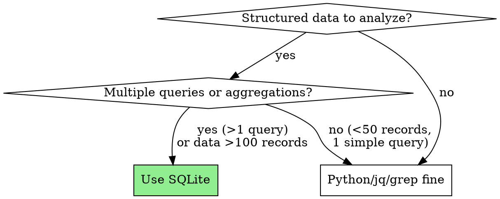

# SQLite for Structured Data

## STOP - Before You Start

**Before writing any data analysis code, answer these questions:**

1. Will I query this data more than once? → **Use SQLite**
2. Do I need GROUP BY, COUNT, AVG, or JOIN? → **Use SQLite**
3. Am I about to write Python/jq parsing code? → **Use SQLite instead**
4. Is the dataset >100 records? → **Use SQLite**

If you answered YES to any question above, use SQLite. Don't write custom parsing code.

## Core Principle

**SQLite is just a file** - no server, no setup, zero dependencies. Use it when you'd otherwise write custom parsing code or re-process data for each query.

## Common Misconception

❌ **"Databases are too complex for small datasets"**

Reality: SQLite = simpler than writing JSON parsing code.

```bash
# This is "complex" (custom code for every query):
cat data.json | jq '.[] | select(.status=="failed")' | jq -r '.error_type' | sort | uniq -c

# This is "simple" (SQL does the work):
sqlite3 data.db "SELECT error_type, COUNT(*) FROM errors WHERE status='failed' GROUP BY error_type"
```

**Setup cost:** `sqlite3 file.db` - that's it. It's just a file like JSON.

## When to Use SQLite

Use when ANY of these apply:

- **>100 records** - JSON/grep becomes unwieldy
- **Multiple aggregations** - Need to GROUP BY, COUNT, AVG, etc.
- **Multiple queries** - Will ask follow-up questions about same data
- **Correlation needed** - Joining data from multiple sources
- **State tracking** - Need queryable progress/status over time

## When NOT to Use SQLite

Don't use when ALL of these are true:

- <50 records total
- Single simple query
- No aggregations needed
- Won't have follow-up questions

→ For tiny datasets with simple access, JSON/grep is fine.

## Red Flags - Use SQLite Instead

STOP and use SQLite if you're about to:

- Write Python/Node code to parse JSON/CSV for analysis
- Run same jq/grep command with slight variations
- Write custom aggregation logic (COUNT, AVG, GROUP BY in code)
- Manually correlate data by timestamps or IDs
- Create temp files to store intermediate results
- Process same data multiple times for different questions

**All of these mean: Load into SQLite once, query with SQL.**

## Decision Flow



## The Threshold

| Scenario | Tool | Why |
|----------|------|-----|
| 50 test results, one-time summary | Python/jq | Fast, appropriate |
| 200+ test results, find flaky tests | **SQLite** | GROUP BY simpler than code |
| 3 log files, correlate by time | **SQLite** | JOIN simpler than manual grep |
| Track 1000+ file processing state | **SQLite** | Queries beat JSON parsing |

**Rule of thumb:** If you're writing parsing code or re-processing data → use SQLite instead.

## Available Tools

```bash
# Built-in command
sqlite3 ~/.claude-logs/project.db

# User has sqlite-utils installed (even easier)
sqlite-utils insert data.db table_name data.json --pk=id
sqlite-utils query data.db "SELECT * FROM table"
```

## Quick Start

### Store Location
```bash
~/.claude-logs/<project-name>.db  # Persists across sessions
```

### Basic Workflow
```bash
# 1. Connect
PROJECT=$(basename $(git rev-parse --show-toplevel 2>/dev/null || pwd))
sqlite3 ~/.claude-logs/$PROJECT.db

# 2. Create table (first time)
CREATE TABLE results (
  id INTEGER PRIMARY KEY,
  name TEXT,
  status TEXT,
  duration_ms INTEGER
);

# 3. Load data
INSERT INTO results (name, status, duration_ms)
SELECT json_extract(value, '$.name'),
       json_extract(value, '$.status'),
       json_extract(value, '$.duration_ms')
FROM json_each(readfile('data.json'));

# 4. Query (SQL does the work)
SELECT status, COUNT(*), AVG(duration_ms)
FROM results
GROUP BY status;
```

## Python vs SQL: Side-by-Side

**Task:** Find error types and their counts from test results.

### Python Approach (What agents default to):
```python
import json
from collections import defaultdict

# Load and parse
with open('test-results.json') as f:
    data = json.load(f)

# Custom aggregation logic
errors_by_type = defaultdict(int)
for record in data:
    if record['status'] == 'failed' and record['error_message']:
        # Extract error type (custom parsing)
        error_type = record['error_message'].split(':')[0]
        errors_by_type[error_type] += 1

# Sort and display (more custom code)
sorted_errors = sorted(errors_by_type.items(), key=lambda x: x[1], reverse=True)
for error_type, count in sorted_errors:
    print(f"{error_type}: {count}")
```

**Lines of code:** 15+ lines of custom logic

### SQLite Approach (Simpler):
```bash
# Load once
sqlite3 data.db <<EOF
CREATE TABLE IF NOT EXISTS results (status TEXT, error_message TEXT);
.import --json test-results.json results
EOF

# Query (SQL does aggregation)
sqlite3 data.db "
  SELECT substr(error_message, 1, instr(error_message, ':')-1) as error_type,
         COUNT(*) as count
  FROM results
  WHERE status='failed' AND error_message IS NOT NULL
  GROUP BY error_type
  ORDER BY count DESC
"
```

**Lines of code:** 3 lines (load once, query many times)

**Key difference:** With Python, you write parsing/aggregation logic. With SQL, you write what you want and SQL does it.

## Real Examples from Baseline

### Example 1: Test Analysis (224 results)
**Without SQLite:** Wrote Python code, loaded to memory, custom aggregation logic, data discarded.

**With SQLite:**
```sql
CREATE TABLE test_runs (test_name TEXT, status TEXT, duration_ms INT, run_id TEXT);
-- Load once
INSERT INTO test_runs SELECT ...;

-- Query many times (no re-processing!)
-- Find flaky tests
SELECT test_name,
       SUM(CASE WHEN status='pass' THEN 1 ELSE 0 END) as passes,
       SUM(CASE WHEN status='fail' THEN 1 ELSE 0 END) as fails
FROM test_runs
GROUP BY test_name
HAVING passes > 0 AND fails > 0;

-- Slowest tests
SELECT test_name, AVG(duration_ms) FROM test_runs GROUP BY test_name ORDER BY AVG(duration_ms) DESC LIMIT 10;
```

### Example 2: Error Correlation (3 log files)
**Without SQLite:** Used jq/grep/pipes, re-processed for each question, manual timestamp correlation.

**With SQLite:**
```sql
CREATE TABLE errors (timestamp TEXT, service TEXT, error_type TEXT, message TEXT);
-- Load all 3 files once
INSERT INTO errors SELECT ...;

-- Find cross-service failures (JOIN is easier than grep)
SELECT e1.timestamp, e1.service, e2.service
FROM errors e1 JOIN errors e2
ON datetime(e1.timestamp) BETWEEN datetime(e2.timestamp, '-5 minutes') AND datetime(e2.timestamp, '+5 minutes')
WHERE e1.service != e2.service;

-- Error frequency
SELECT error_type, COUNT(*) FROM errors GROUP BY error_type ORDER BY COUNT(*) DESC;
```

### Example 3: File Processing State (50 files)
**Without SQLite:** Wrote custom JSON parsing code, manual state updates, custom query logic.

**With SQLite:**
```sql
CREATE TABLE files (name TEXT PRIMARY KEY, status TEXT, error TEXT, completed_at TEXT);

-- Initialize
INSERT INTO files (name, status) VALUES ('file1.txt', 'pending');

-- Update state
UPDATE files SET status='completed', completed_at=datetime('now') WHERE name='file1.txt';

-- Queries (no custom code!)
SELECT COUNT(*) FROM files WHERE status='completed';
SELECT * FROM files WHERE status='failed';
SELECT * FROM files WHERE status='pending' LIMIT 1;  -- next file
```

Note: For only 50 files with simple queries, JSON was actually fine! Use SQLite when you need complex queries or >100 files.

## Key Mindset Shift

**From:** "Process data once and done"
**To:** "Make data queryable"

Benefits:
- User asks follow-up → data already loaded
- Try different analyses → no re-processing
- State persists across sessions
- SQL handles complexity → you write less code

## Common Mistakes

| Mistake | Fix |
|---------|-----|
| "Too complex for my small dataset" | SQLite = just a file. Try it. |
| Writing JSON parsing code | Use SQL SELECT instead |
| Re-running jq/grep for each query | Load once with INSERT, query with SELECT |
| Assuming "database" = "server" | SQLite has no server, it's a local file |

## Red Flags - Consider SQLite

- Writing custom aggregation code
- Running same grep/jq command with slight variations
- Manually correlating data from multiple files
- Thinking "I wish I could just query this"

**All of these mean: Use SQLite instead.**
